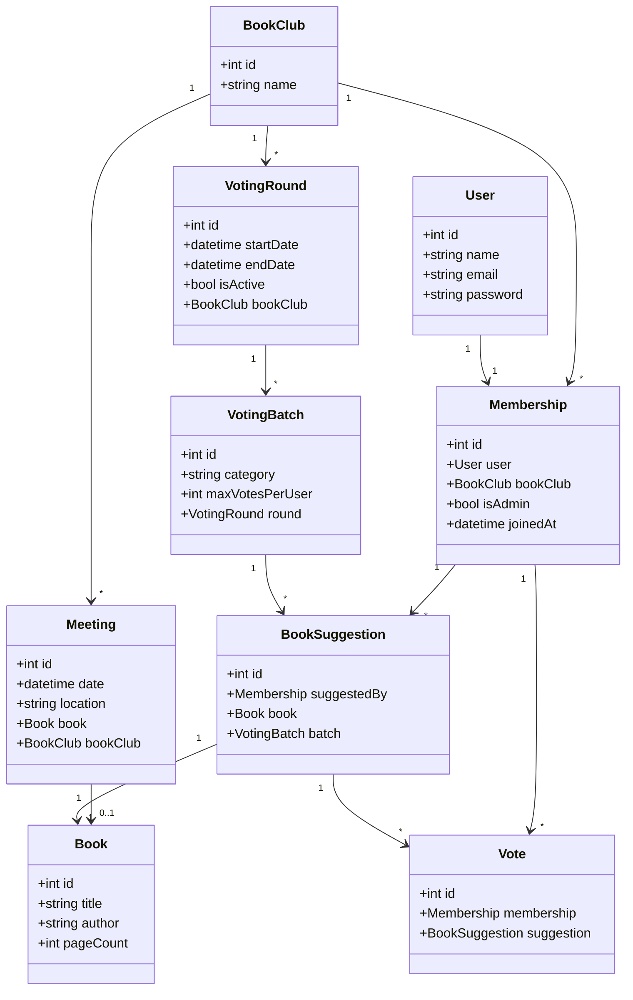

```mermaid
classDiagram
    class User {
        +int id
        +string name
        +string email
        +string password
    }
    class Membership {
        +int id
        +User user
        +BookClub bookClub
        +bool isAdmin
        +datetime joinedAt
    }
    class BookClub {
        +int id
        +string name
    }
    class Meeting {
        +int id
        +datetime date
        +string location
        +Book book
        +BookClub bookClub
    }
    class Book {
        +int id
        +string title
        +string author
        +int pageCount
    }
    class VotingRound {
        +int id
        +datetime startDate
        +datetime endDate
        +bool isActive
        +BookClub bookClub
    }
    class VotingBatch {
        +int id
        +string category
        +int maxVotesPerUser
        +VotingRound round
    }
    class BookSuggestion {
        +int id
        +Membership suggestedBy
        +Book book
        +VotingBatch batch
    }
    class Vote {
        +int id
        +Membership membership
        +BookSuggestion suggestion
    }

    User "1" --> "1" Membership
    BookClub "1" --> "*" Membership
    BookClub "1" --> "*" Meeting
    BookClub "1" --> "*" VotingRound
    VotingRound "1" --> "*" VotingBatch
    VotingBatch "1" --> "*" BookSuggestion
    BookSuggestion "1" --> "1" Book
    BookSuggestion "1" --> "*" Vote
    Membership "1" --> "*" BookSuggestion
    Membership "1" --> "*" Vote
    Meeting "1" --> "0..1" Book
```